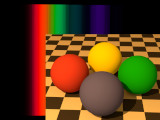

# IntegrateLight

A tool for integrating spectral curves, intended for use with Lilysoft's POV-Ray spectral renderer. The intention is to capture sharp peaks in continuous emission spectra, but it also works with reflection spectra.

This project is a module from the Persistence of Vision Raytracer (POV-Ray) Object Collection.
